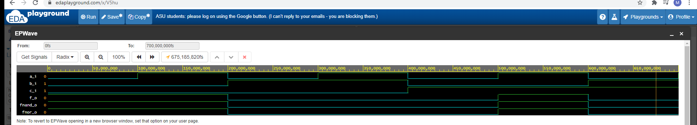
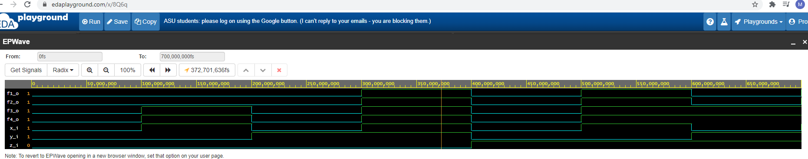

# 01-gates
### Link na GitHub
https://github.com/Libericatagua/Digital-electronics-1
### De Morganove zákony

```vhld
architecture dataflow of gates is
begin
    f_o      <= ((not b_i) and a_i) or ((not c_i) and (not b_i));
    fnand_o  <= not(not (not b_i and a_i) and not(not b_i and not c_i));
    fnor_o   <= (not (b_i or not a_i)) or (not (c_i or b_i));

end architecture dataflow;
```



### Link na EDAplayground
https://www.edaplayground.com/x/V5hu


| **c** | **b** |**a** | **f(c,b,a)** |
| :-: | :-: | :-: | :-: |
| 0 | 0 | 0 | 1 |
| 0 | 0 | 1 | 1 |
| 0 | 1 | 0 | 0 |
| 0 | 1 | 1 | 0 |
| 1 | 0 | 0 | 0 |
| 1 | 0 | 1 | 1 |
| 1 | 1 | 0 | 0 |
| 1 | 1 | 1 | 0 |

### Overenie pravidiel
```vhld

architecture dataflow of gates is
begin
    f1_o  <= (x_i and y_i) or (x_i and z_i);
    f2_o  <= x_i and (y_i or z_i);
    f3_o  <= (x_i or y_i) and (x_i or z_i);
    f4_o  <= x_i or (y_i and z_i);

end architecture dataflow;

```
# Neviem prečo sa mi to kód neukazuje ako kód (zvýraznenie funkcii)


### Link na EDAplayground
https://www.edaplayground.com/x/8Q6q