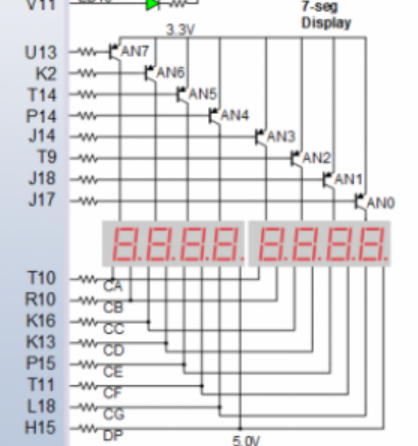
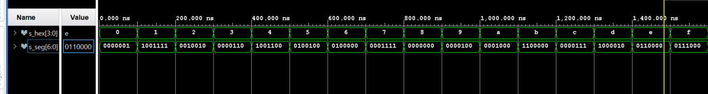
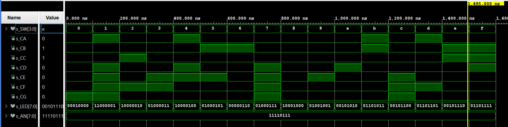

## 1 
### zapojenie

### tabulka
| Hex | Inputs | A | B | C | D | E | F | G |
| :-: | :-: | :-: | :-: | :-: | :-: | :-: | :-: | :-: |
| 0 | 0000 | 0 | 0 | 0 | 0 | 0 | 0 | 1 |
| 1 | 0001 | 1 | 0 | 0 | 1 | 1 | 1 | 1 |
| 2 | 0010 | 0 | 0 | 1 | 0 | 0 | 1 | 0 |
| 3 | 0011 | 0 | 0 | 0 | 0 | 1 | 1 | 0 |
| 4 | 0100 | 1 | 0 | 0 | 1 | 1 | 0 | 0 |
| 5 | 0101 | 0 | 1 | 0 | 0 | 1 | 0 | 0 |
| 6 | 0110 | 0 | 1 | 0 | 0 | 0 | 0 | 0 |
| 7 | 0111 | 0 | 0 | 1 | 1 | 1 | 1 | 1 |
| 8 | 1000 | 0 | 0 | 0 | 0 | 0 | 0 | 0 |
| 9 | 1001 | 0 | 0 | 0 | 0 | 1 | 0 | 0 |
| A | 1010 | 0 | 0 | 0 | 1 | 0 | 0 | 0 |
| b | 1011 | 1 | 1 | 0 | 0 | 0 | 0 | 0 |
| C | 1100 | 0 | 1 | 1 | 0 | 0 | 0 | 1 |
| d | 1101 | 1 | 0 | 0 | 0 | 0 | 1 | 0 |
| E | 1110 | 0 | 1 | 1 | 0 | 0 | 0 | 0 |
| F | 1111 | 0 | 1 | 1 | 1 | 0 | 0 | 0 |

## 2 
### display
```vhdl
begin
    p_7seg_decoder : process(hex_i)
    begin
        case hex_i is
            when "0000" => seg_o <= "0000001";  --0
            when "0001" => seg_o <= "1001111";  --1
            when "0010" => seg_o <= "0010010";  --2
            when "0011" => seg_o <= "0000110";  --3
            when "0100" => seg_o <= "1001100";  --4
            when "0101" => seg_o <= "0100100";  --5
            when "0110" => seg_o <= "0100000";  --6
            when "0111" => seg_o <= "0001111";  --7
            when "1000" => seg_o <= "0000000";  --8
            when "1001" => seg_o <= "0000100";  --9
            when "1010" => seg_o <= "0001000";  --A
            when "1011" => seg_o <= "1100000";  --B
            when "1100" => seg_o <= "0000111";  --C
            when "1101" => seg_o <= "1000010";  --D
            when "1110" => seg_o <= "0110000";  --E
            when others => seg_o <= "0111000";  --F
        end case;
    end process p_7seg_decoder;                                                
```
### testbench
```vhdl
p_stimulus : process
    begin
        report "Stimulus process started" severity note;
      
        s_hex <= "0000"; wait for 100ns;  --0
        s_hex <= "0001"; wait for 100ns;  --1
        s_hex <= "0010"; wait for 100ns;  --2
        s_hex <= "0011"; wait for 100ns;  --3
        s_hex <= "0100"; wait for 100ns;  --4
        s_hex <= "0101"; wait for 100ns;  --5
        s_hex <= "0110"; wait for 100ns;  --6
        s_hex <= "0111"; wait for 100ns;  --7
        s_hex <= "1000"; wait for 100ns;  --8
        s_hex <= "1001"; wait for 100ns;  --9
        s_hex <= "1010"; wait for 100ns;  --A
        s_hex <= "1011"; wait for 100ns;  --B
        s_hex <= "1100"; wait for 100ns;  --C
        s_hex <= "1101"; wait for 100ns;  --D
        s_hex <= "1110"; wait for 100ns;  --E
        s_hex <= "1111"; wait for 100ns;  --F       
   
        report "Stimulus process finished" severity note;
        wait;
    end process p_stimulus;

```
### simulácia


### top
```vhdl
hex2seg : entity work.hex_7seg
       port map(
           hex_i    => SW,
   
           seg_o(6)    => CA, 
           seg_o(5)    => CB,
           seg_o(4)    => CC,
           seg_o(3)    => CD,
           seg_o(2)    => CE,
           seg_o(1)    => CF,
           seg_o(0)    => CG
       );
       
    AN <= "11110111";
       
```
## 3
### tabulka
| **Hex** | **Inputs** | **LED4** | **LED5** | **LED6** | **LED7** |
| :-: | :-: | :-: | :-: | :-: | :-: |
| 0 | 0000 | 1 | 0 | 0 | 0 |
| 1 | 0001 | 0 | 0 | 1 | 1 |
| 2 | 0010 | 0 | 0 | 0 | 1 |
| 3 | 0011 | 0 | 0 | 1 | 0 |
| 4 | 0100 | 0 | 0 | 0 | 1 |
| 5 | 0101 | 0 | 0 | 1 | 0 |
| 6 | 0110 | 0 | 0 | 0 | 0 |
| 7 | 0111 | 0 | 0 | 1 | 0 |
| 8 | 1000 | 0 | 0 | 0 | 1 |
| 9 | 1001 | 0 | 0 | 1 | 0 |
| A | 1010 | 0 | 1 | 0 | 0 |
| b | 1011 | 0 | 1 | 1 | 0 |
| C | 1100 | 0 | 1 | 0 | 0 |
| d | 1101 | 0 | 1 | 1 | 0 |
| E | 1110 | 0 | 1 | 0 | 0 |
| F | 1111 | 0 | 1 | 1 | 0 |
### code for leds
```vhdl
 LED(3 downto 0) <= SW;
   LED(4)  <= '1' when (SW = "0000") else '0';
   LED(5)  <= '1' when (SW > "1001") else '0';
   LED(6)  <= '1' when (SW = "0001" or SW = "0011" or SW = "0101" or SW = "0111" or SW = "1001" or SW = "1011" or SW = "1101" or SW = "1111") else '0';
   LED(7)  <= '1' when (SW = "0001" or SW = "0010" or SW = "0100" or SW = "1000") else '0';
```
### simulácia top

