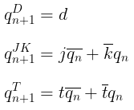
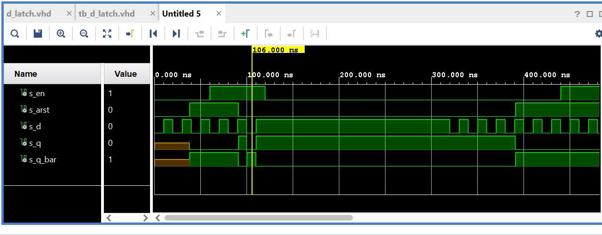
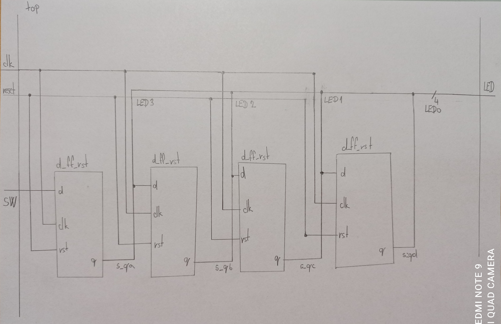

## 1
### Rovnice

### tabulky
| **clk** | **d** | **q(n)** | **q(n+1)** | **Comments** |
| :-: | :-: | :-: | :-: | :-- |
|  | 0 | 0 | 0 | No change |
|  | 0 | 1 | 0 | Change |
|  | 1 | 0 | 1 | No change |
|  | 1 | 1 | 1 | Change |

| **clk** | **j** | **k** | **q(n)** | **q(n+1)** | **Comments** |
| :-: | :-: | :-: | :-: | :-: | :-- |
|  | 0 | 0 | 0 | 0 | No change |
|  | 0 | 0 | 1 | 1 | No change |
|  | 0 | 1 | 0 | 0 | Reset |
|  | 0 | 1 | 1 | 0 | Reset |
|  | 1 | 0 | 0 | 1 | Set |
|  | 1 | 0 | 1 | 1 | Set |
|  | 1 | 1 | 0 | 1 | Toggle |
|  | 1 | 1 | 1 | 0 | Toggle |

| **clk** | **t** | **q(n)** | **q(n+1)** | **Comments** |
| :-: | :-: | :-: | :-: | :-- |
|  | 0 | 0 | 0 | No change |
|  | 0 | 1 | 1 | No change |
|  | 1 | 0 | 1 | Toggle |
|  | 1 | 1 | 0 | Toggle |

## 2
### process p_d_latch
```vhdl
p_d_latch : process (d, arst, en)
begin
    if (arst = '1') then
        q        <= '0';
        q_bar    <= '1';
    elsif (en = '1') then
        q        <= d;
        q_bar    <= not d;    
       
    end if;
end process p_d_latch;
```
### tb_d_latch
```vhdl
P_reset_gen  : process
    begin
        s_arst    <= '0';
        wait for 38 ns;
        s_arst    <= '1';
        wait for 53 ns;
        s_arst    <= '0';
        wait for 300 ns;
        s_arst    <= '1'; 
        
        wait;
    end process p_reset_gen;
    
    p_stimulus : process
    begin
        report "Stimulus process started" severity note;
        s_d    <= '0';
        s_en   <= '0';
        assert (s_q = '0');
        report "asda asd" severity error;
        
        wait for 10 ns;
        s_d <= '1';
        wait for 10 ns;
        s_d <= '0';
        wait for 10 ns;
        s_d <= '1';
        wait for 10 ns;
        s_d <= '0';
        wait for 10 ns;
        s_d <= '1';
        wait for 10 ns;
        s_d <= '0';
        
        assert (s_q = '0' and s_q_bar = '1')
        report "asda asd" severity error;
        s_en   <= '1';
        
        wait for 10 ns;
        s_d <= '1';
        wait for 10 ns;
        s_d <= '0';
        wait for 10 ns;
        s_d <= '1';
        wait for 10 ns;
        s_d <= '0';
        wait for 10 ns;
        s_d <= '1'; 
        wait for 10 ns;      
        s_en <='0'; 
        wait for 200 ns;
        s_d <= '0';
        
        wait for 10 ns;
        s_d <= '1';
        wait for 10 ns;
        s_d <= '0';
        wait for 10 ns;
        s_d <= '1';
        wait for 10 ns;
        s_d <= '0';
        wait for 10 ns;
        s_d <= '1';
        wait for 10 ns;
        s_d <= '0';
        
        wait for 10 ns;
        s_d <= '1';
        wait for 10 ns;
        s_d <= '0';
        wait for 10 ns;
        s_d <= '1';
        wait for 10 ns;
        s_d <= '0';
        wait for 10 ns;
        s_d <= '1';
        wait for 10 ns;
        s_d <= '0';
        
        s_en   <= '1';
        
         wait for 10 ns;
        s_d <= '1';
        wait for 10 ns;
        s_d <= '0';
        wait for 10 ns;
        s_d <= '1';
        wait for 10 ns;
        s_d <= '0';
        wait for 10 ns;
        s_d <= '1';
        wait for 10 ns;
        s_d <= '0';

        report "Stimulux process finished" severity note;
        wait;
    end process p_stimulus;
```


## 3 design
### p_d_ff_arst
```vhdl
p_d_ff_arst : process (clk, arst)
    begin
        if (arst = '1') then
            q     <= '0';
            q_bar <= '1';
        elsif rising_edge(clk) then
            q     <= d;
            q_bar <= not d;
        end if;
    end process p_d_ff_arst;
```
### p_d_ff_rst
```vhdl
p_d_ff_arst : process (clk, arst)
    begin
        if rising_edge(clk) then
            if (rst = '1') then
                q     <= '0';
                q_bar <= '1';
            else
                q     <= d;
                q_bar <= not d;
            end if;
        end if;
    end process p_d_ff_rst;
```
### p_jk_ff_rst
```vhdl
p_jk_ff_rst : process (clk)
        begin
            if rising_edge(clk) then
                if (rst = '1') then
                    s_q <= '0';
                else 
                    if (j = '0' and k = '0') then
                        s_q <= s_q; 
                    elsif (j = '0' and k = '1') then
                        s_q <= '0';
                    elsif (j = '1' and k = '0') then
                        s_q <= '1';
                    elsif (j = '1' and k = '1') then
                        s_q <= not s_q;
                    end if;    
                end if;
            end if;
       
    end process p_jk_ff_rst;
```
### p_t_ff_rst
```vhdl
p_t_ff_rst : process (clk)
begin
    if rising_edge(clk) then
        if (rst = '1') then
            s_q <= '0';
        elseif (t = '1') then
            s_q <= not s_q;
        end if;
    end if;
end process p_t_ff_rst;
```
## 3 tb
### tb_d_ff_arst clock, reset, stimulus
```vhdl
p_clk_gen : process
     begin
        while now < 750 ns loop
            s_clk_100MHZ <= '0';
            wait for c_CLK_100MHZ_PERIOD / 2;
            s_clk_100MHZ <= '1';
            wait for c_CLK_100MHZ_PERIOD / 2;
       end loop;
       wait; 
    end process p_clk_gen;

--------------------------------------------------------------------
    -- Reset generation process
    --------------------------------------------------------------------

     p_reset_gen : process
        begin
            s_arst <= '0';
            wait for 60 ns;
            
            -- Reset activated
            s_arst <= '1';
            wait for 15 ns;
    
            --Reset deactivated
            s_arst <= '0';
            
            --wait for 17 ns;
               
            wait;
     end process p_reset_gen;

--------------------------------------------------------------------
    -- Data generation process
    --------------------------------------------------------------------
    p_stimulus : process
    begin
        report "Stimulus process started" severity note;
        
          --d sequence 
        wait for 15ns;
        s_d  <= '1';
        wait for 10ns;
        s_d  <= '0';
        wait for 10ns;
        s_d  <= '1';
        wait for 10ns;
        s_d  <= '0';
        wait for 10ns;
        s_d  <= '1';
        wait for 10ns;
        s_d  <= '0';
        wait for 10ns;
        --d sequence
        
        assert ((s_arst = '0') and (s_q = '1') and (s_q_bar = '0'))
        report "Test failed for reset low, after clk rising when s_d = '1'" severity error;
        
       
        report "Stimulus process finished" severity note;
        wait;
    end process p_stimulus;
```
### simulácia


### tb_jk_ff_rst clock reset stimulus
```vhdl
p_clk_gen : process
     begin
        while now < 750 ns loop
            s_clk_100MHZ <= '0';
            wait for c_CLK_100MHZ_PERIOD / 2;
            s_clk_100MHZ <= '1';
            wait for c_CLK_100MHZ_PERIOD / 2;
       end loop;
       wait; 
    end process p_clk_gen;

 p_reset_gen : process
        begin
            s_rst <= '0';
            wait for 60 ns;
            
            -- Reset activated
            s_rst <= '1';
            wait for 15 ns;
    
            --Reset deactivated
            s_rst <= '0';
            
            --wait for 17 ns;
               
            wait;
     end process p_reset_gen;
     
 
 p_stimulus : process
    begin
        report "Stimulus process started" severity note;
        
          --d sequence 
        wait for 15ns;
        s_j  <= '0';
        s_k  <= '0';
        wait for 20ns;
        s_j  <= '0';
        s_k  <= '1';
        wait for 20ns;
        s_j  <= '1';
        s_k  <= '0';
        wait for 20ns;
        s_j  <= '1';
        s_k  <= '1';
        assert ((s_rst = '0') and (s_j = '0') and (s_k = '0') and (s_q = '0') and (s_q_bar = '1'))
	    report "Test 'no change' failed for reset low, after clk rising when s_j = '0' and s_k = '0'" severity error;
        
    
        wait for 10ns;
        s_j  <= '1';
        s_k  <= '1';
        wait for 10ns;
        s_j  <= '1';
        s_k  <= '1';
        wait for 10ns;
        --d sequence
               
        report "Stimulus process finished" severity note;
        wait;
    end process p_stimulus;
```
### simulácia

### p_d_ff_rst
```vhdl
p_clk_gen : process
         begin
	           while now < 750 ms loop        
	           s_clk_100MHZ <= '0';
		       wait for c_CLK_100MHZ_PERIOD / 2;
		       s_clk_100MHZ <= '1';
		       wait for c_CLK_100MHZ_PERIOD / 2;
	         end loop;
	wait;
end process p_clk_gen;
    
    --------------------------------------------------------------------
    -- Reset generation process
    --------------------------------------------------------------------

     p_reset_gen : process
        begin
            s_rst <= '0';
            wait for 60 ns;
            
            -- Reset activated
            s_rst <= '1';
            wait for 15 ns;
    
            --Reset deactivated
            s_rst <= '0';
            
            --wait for 17 ns;
               
            wait;
     end process p_reset_gen;

--------------------------------------------------------------------
    -- Data generation process
    --------------------------------------------------------------------
    p_stimulus : process
    begin
        report "Stimulus process started" severity note;
        
          --d sequence 
        wait for 15ns;
        s_d  <= '1';
        wait for 10ns;
        s_d  <= '0';
        wait for 10ns;
        s_d  <= '1';
        wait for 10ns;
        s_d  <= '0';
        wait for 10ns;
        s_d  <= '1';
        wait for 10ns;
        s_d  <= '0';
        wait for 10ns;
        --d sequence
        assert ((s_rst = '1') and (s_q = '1') and (s_q_bar = '0'))
	    report "Test failed for reset high, before clk rising when s_d = '1'" severity error;
	
        
       
        report "Stimulus process finished" severity note;
        wait;
    end process p_stimulus;
``` 
### simulacia

### tb_t_ff_rst
```vhdl
p_clk_gen : process
     begin
        while now < 750 ns loop
            s_clk_100MHZ <= '0';
            wait for c_CLK_100MHZ_PERIOD / 2;
            s_clk_100MHZ <= '1';
            wait for c_CLK_100MHZ_PERIOD / 2;
       end loop;
       wait; 
    end process p_clk_gen;

--------------------------------------------------------------------
    -- Reset generation process
    --------------------------------------------------------------------

     p_reset_gen : process
        begin
            s_rst <= '0';
            wait for 60 ns;
            
            -- Reset activated
            s_rst <= '1';
            wait for 15 ns;
    
            --Reset deactivated
            s_rst <= '0';
            
            --wait for 17 ns;
               
            wait;
     end process p_reset_gen;

p_stimulus : process
    begin
        report "Stimulus process started" severity note;
        assert ((s_rst = '0') and (s_t = '0') and (s_q = '0') and (s_q_bar = '1'))
	    report "Test 'no change' failed for reset low, after clk rising when s_t = '0'" severity error;
          --d sequence 
        wait for 15ns;
        s_t  <= '0';
        s_q  <= '0';
        wait for 20ns;
        s_t  <= '0';
        s_q  <= '1';
        wait for 20ns;
        s_t  <= '1';
        s_q  <= '0';
        wait for 20ns;
        s_t  <= '1';
        s_q  <= '1';
        
        wait for 10ns;
        s_t  <= '1';
        s_q  <= '1';
        wait for 10ns;
        s_t  <= '1';
        s_q  <= '1';
        wait for 10ns;
        --d sequence
               
        report "Stimulus process finished" severity note;
        wait;
    end process p_stimulus;
```

## 4

### schéma

```vhdl

```